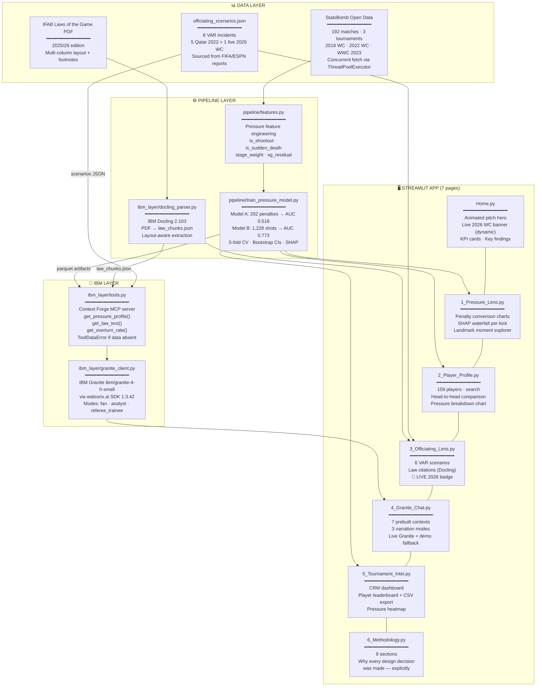
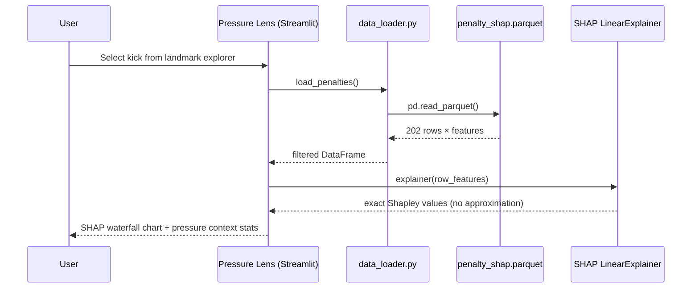
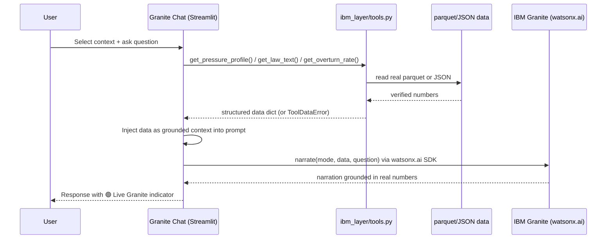
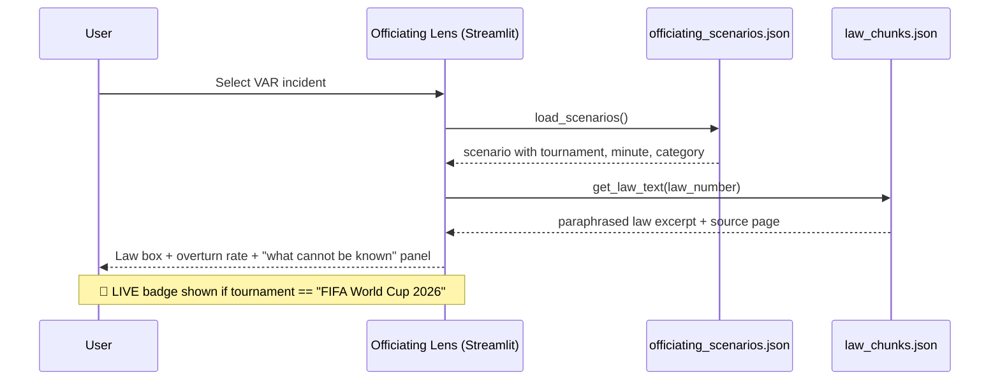
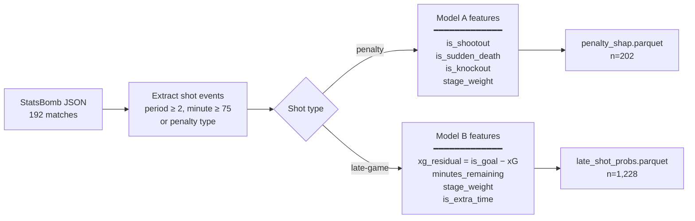
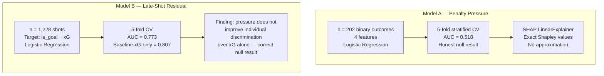
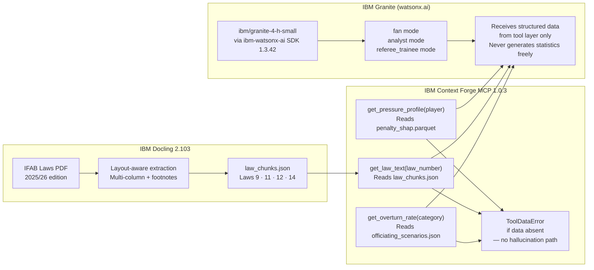
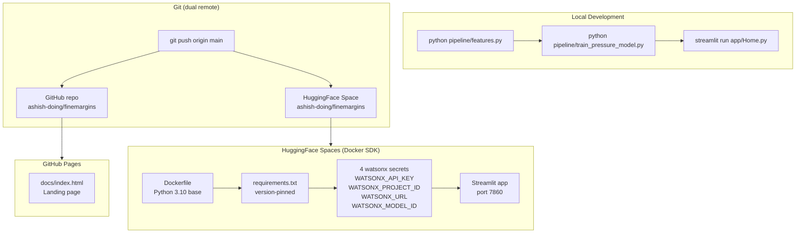
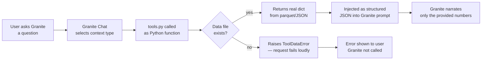

# FineMargins — Architecture

## Overview

FineMargins has two analytical lenses — a **Pressure Pipeline** that trains ML models on real World Cup shot data, and an **Officiating Lens** that grounds IBM Granite narration in IFAB Laws parsed by IBM Docling. Both lenses feed into a 7-page Streamlit app deployed via Docker on HuggingFace Spaces.

---

## System Diagram

---

## Request Flow — Pressure Lens

---

## Request Flow — Granite Chat

---

## Request Flow — Officiating Lens

---

## Pipeline — Feature Engineering

---

## Model Architecture

---

## IBM Technology Layer

---

## Deployment Architecture

---

## Data Flow — Anti-Hallucination

---

## Component Map

| File | Responsibility |
|---|---|
| `app/Home.py` | Entry point — animated pitch hero, dynamic 2026 WC banner, KPI cards, explore lenses, how-to-use guide |
| `app/data_loader.py` | Cached `@st.cache_data` loaders for all parquet/JSON artifacts |
| `app/pages/1_Pressure_Lens.py` | Penalty conversion charts, SHAP waterfall, xG residual by minute, landmark explorer |
| `app/pages/2_Player_Profile.py` | 159 player profiles, search, head-to-head comparison |
| `app/pages/3_Officiating_Lens.py` | 6 VAR scenarios, IFAB Law citations, overturn rates, 🔴 LIVE 2026 badge |
| `app/pages/4_Granite_Chat.py` | 7 prebuilt contexts, 3 narration modes, live Granite + verified demo fallback |
| `app/pages/5_Tournament_Intel.py` | Cross-tournament CRM dashboard, player leaderboard, CSV export, pressure heatmap |
| `app/pages/6_Methodology.py` | 9-section methodology — why every pipeline decision was made |
| `pipeline/features.py` | StatsBomb concurrent fetch + pressure feature engineering → parquet |
| `pipeline/train_pressure_model.py` | Model A + B training, 5-fold CV, bootstrap CIs, SHAP artifacts |
| `ibm_layer/granite_client.py` | watsonx.ai SDK client — narrate(mode, data, question) |
| `ibm_layer/docling_parser.py` | IFAB Laws PDF → law_chunks.json via IBM Docling |
| `ibm_layer/tools.py` | Context Forge MCP server — 3 grounding tools + ToolDataError |
| `ibm_layer/law_chunks.json` | Parsed IFAB Laws 2025/26 (Laws 9, 11, 12, 14) |
| `ibm_layer/officiating_scenarios.json` | 6 VAR incidents with Law citations, overturn rates, sourcing |
| `data/processed/` | Committed parquet files — no pipeline run needed to explore app |
| `tests/` | 18 tests — pipeline contracts, model output schema, tool data grounding |
| `docs/index.html` | GitHub Pages landing page |
| `Dockerfile` | Docker SDK config for HF Spaces — Python 3.10, port 7860 |

---

## Key Version Constraints

| Package | Version | Reason |
|---|---|---|
| `streamlit` | `>=1.35.0` | `st.page_link` requires 1.31+; st.html requires 1.35+ |
| `ibm-watsonx-ai` | `==1.3.42` | 1.5.13+ requires Python 3.11; API signatures identical |
| `shap` | `>=0.44.0,<0.50.0` | 0.52+ requires Python 3.12+ |
| `python` | `3.10` | HF Spaces Docker base + dependency ceiling |

---

*Built for the IBM SkillsBuild AI Builders Challenge, June 2026 — "AI Inside the Match"*