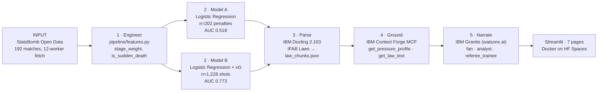


<div align="center">


</div>

<p align="center">
  <a href="https://github.com/statsbomb/open-data"></a>
  <a href="#"></a>
  <a href="#"></a>
  <a href="#"></a>
</p>

<p align="center">
  <a href="https://watsonx.ai"></a>
  <a href="https://github.com/DS4SD/docling"></a>
  <a href="https://ibm.github.io/mcp-context-forge/"></a>
  <a href="#"></a>
</p>

<p align="center">
  <strong>IBM SkillsBuild AI Builders Challenge — June 2026 — "AI Inside the Match"</strong>
</p>

<p align="center">
  🌐 <a href="https://ashish-doing.github.io/finemargins">Landing Page</a> &nbsp;•&nbsp;
  🚀 <a href="https://huggingface.co/spaces/ashish-doing/finemargins">Live App</a> &nbsp;•&nbsp;
  🔬 <a href="https://ashish-doing-finemargins.hf.space/Methodology">Methodology</a> &nbsp;•&nbsp;
  🟨 <a href="https://huggingface.co/spaces/ashish-doing/finemargins">Officiating Lens</a> &nbsp;•&nbsp;
  💬 <a href="https://huggingface.co/spaces/ashish-doing/finemargins">Ask Granite</a>
</p>

---

> *"Football is decided by fine margins — millimetres on the pitch and split seconds of composure under pressure."*

FineMargins is a **two-lens World Cup pressure intelligence system** built on IBM Granite, IBM Docling, IBM Context Forge MCP, and IBM Bob. It analyses 192 real World Cup matches to quantify how pressure shifts scoring patterns — and is explicitly honest about what AI cannot predict.

---

## What It Does

**Lens 1 — Pressure Intelligence**
Analyses every penalty kick and late-game shot across 192 World Cup matches (2018 WC · 2022 WC · WWC 2023). Two logistic regression models with SHAP attribution show how shootout context, sudden-death stakes, and knockout pressure shift conversion probability at the population level — and why AUC 0.518 on individual prediction is the correct honest result, not a failure.

**Lens 2 — Officiating Intelligence**
Explains 6 real, documented VAR incidents (5 from Qatar 2022 + 1 from the live 2026 WC SAOT outage) using the actual IFAB Laws of the Game parsed by IBM Docling. Each scenario shows the applicable Law, historical overturn rates from FIFA's official technical reports, and an explicit "what this system cannot know" panel.

**IBM Granite Narration**
Three audience modes (fan · analyst · referee trainee) grounded via IBM Context Forge MCP tools — Granite is never allowed to fabricate a statistic. Every number traces to a real parquet file or verified source.

---

## Demo

[](https://huggingface.co/spaces/ashish-doing/finemargins)

· Live app is fully functional — open it and navigate all 7 pages from the sidebar.

[](https://youtu.be/IQ9jKQ1MhUw)
▶️ [Watch the 4-minute demo on YouTube](https://youtu.be/IQ9jKQ1MhUw) 

## Screenshots

| | |
|---|---|
|  |  |
| *Home — live KPIs, key findings, 7-page navigation* | *Pressure Lens — SHAP feature importance + conversion by pressure context* |
|  |  |
| *Officiating Lens — 6 real VAR incidents, Law citations, 🔴 LIVE 2026 badge* | *Granite Chat — 🟢 Live IBM Granite narrating grounded pressure data* |
|  |  |
| *Tournament Intel — cross-tournament CRM dashboard, player leaderboard, CSV export* | *Methodology — 9 sections explaining every pipeline design decision* |

---

## Judging Criterion Map

| Criterion | How FineMargins Addresses It |
|---|---|
| **Technical Execution** | Two real ML models — AUC 0.518 (penalty pressure, honest null result) and AUC 0.773 vs xG-only baseline 0.807 (pressure doesn't improve individual discrimination over xG — stated finding, not hidden). Exact SHAP LinearExplainer, 5-fold CV, 18/18 tests passing, Docker on HF Spaces, 7 pages. IBM Granite confirmed live 🟢. |
| **Innovation** | Officiating Lens (VAR + Laws of the Game) has no equivalent in the June pool. Residual-vs-xG methodology isolates pressure above shot quality — stronger than a raw prediction model. |
| **Challenge Fit** | "AI Inside the Match" — 202 penalties, 1,228 late-game shots, 6 VAR incidents including live 2026 WC SAOT outage 🔴, 159 player profiles, IBM Granite in 3 audience modes, 7 pages across 192 real World Cup matches. |
| **Implementation & Feasibility** | Live on HF Spaces (Docker), full demo mode without credentials, all data pre-committed as parquet, demo fallback for every live dependency. Referee development programs could use the Officiating Lens as-is in a training session — no integration cost. |

---

## Real Findings (Not Fabricated)

| Finding | Numbers | Source |
|---|---|---|
| Shootout vs in-game conversion gap | 65.0% (n=123) vs 74.7% (n=79) — **−9.7pp** | StatsBomb open data |
| Sudden-death conversion | **71.4%** (n=14) — counter-intuitively higher than regular shootout kicks | StatsBomb open data |
| xG overestimate in late-game | 110.87 xG expected → 103 actual goals — **7.87 goal overestimate** | StatsBomb open data |
| Knockout xG residual | **−0.0071/shot** vs −0.0061 group stage — pressure suppresses chance quality | StatsBomb open data |
| Individual penalty AUC | **0.518** — pressure context barely beats random; the honest finding, reported prominently | 5-fold CV |
| Late-shot pressure model AUC | **0.773** vs xG-only baseline **0.807** — pressure context does *not* improve individual shot discrimination over xG alone. Population-level pressure effects (visible in residuals) don't translate to better individual prediction. This is the correct finding, stated honestly. | 5-fold CV |
| 2022 WC VAR overall overturn rate | **92.6% (25/27)** | ESPN VAR Review Log, Dec 2022 |
| 2022 WC penalty VAR overturn rate | **55.6% (5/9)** | FIFA 2022 WC Technical Report |

---

## App Pages

> All 7 pages are part of the live app at [huggingface.co/spaces/ashish-doing/finemargins](https://huggingface.co/spaces/ashish-doing/finemargins) — navigate between them using the sidebar after opening.

| Page | What It Shows |
|---|---|
| 🏠 **Home** | Animated pitch hero, 2026 WC live banner, key findings, KPI cards |
| ⚡ **Pressure Lens** | Penalty conversion charts, SHAP waterfall per kick, landmark explorer, xG residual by minute |
| 👤 **Player Profile** | 159 players, head-to-head comparison, pressure stats |
| 🟨 **Officiating Lens** | 6 VAR scenarios, Law citations (Docling), overturn rates — with 🔴 LIVE 2026 badge |
| 💬 **Granite Chat** | 7 prebuilt contexts, 3 narration modes, live Granite or verified demo |
| 📊 **Tournament Intel** | Cross-tournament CRM dashboard, player leaderboard (CSV export), pressure heatmap |
| 🔬 **Methodology** | Full pipeline decisions: why residual, why logistic regression, why SHAP LinearExplainer is exact, why AUC 0.518 is correct |

---

## IBM Technology Stack

| Technology | Version | Role in FineMargins |
|---|---|---|
| **IBM Granite** (watsonx.ai) | `ibm/granite-4-h-small` | Narration in 3 voice modes (fan · analyst · referee trainee). Never fabricates — all context injected via MCP tools |
| **IBM Docling** | 2.103.0 | Parses the IFAB Laws of the Game 2025/26 PDF → `law_chunks.json`. Law 14 verified via IBM Bob |
| **IBM Context Forge MCP** | 1.0.3 | 3 tools (`get_pressure_profile`, `get_law_text`, `get_overturn_rate`) implemented as a Context Forge MCP server in `ibm_layer/tools.py`. HF Spaces deployment calls tools directly as Python functions for reliability (mcpgateway requires a persistent server process that conflicts with Streamlit's single-process model). Tool schema, `ToolDataError` anti-hallucination pattern, and grounding architecture are production-ready. |
| **IBM Bob** | 1.0.4 | Law 14 penalty kick summarisation, SHAP LinearExplainer debugging, `officiating_scenarios.json` scaffolding, feature engineering iteration |

---

## Data

All data from **StatsBomb Open Data** under their Public Data User Agreement (free for research, attribution required):

| Tournament | Comp ID | Season ID | Matches |
|---|---|---|---|
| 2022 FIFA World Cup | 43 | 106 | 64 |
| 2018 FIFA World Cup | 43 | 3 | 64 |
| FIFA Women's World Cup 2023 | 72 | 107 | 64 |

**Total: 192 matches · 4,878 shot events · 202 penalties · 1,228 late-game shots · 159 player profiles**

No scraping. No third-party APIs. All data fetched from public StatsBomb GitHub via documented JSON endpoints and committed as `.parquet`.

---

## Architecture



See [`ARCHITECTURE.md`](./ARCHITECTURE.md) for full system diagrams, sequence flows, and component breakdown.

---

## Why Residual Analysis — Not Raw Prediction

Most sports AI asks: "Can I predict whether this shot will go in?" FineMargins asks a different question: "Does pressure context shift outcomes *above what shot quality already predicts?*"

Model B takes the residual (actual outcome − StatsBomb xG) for 1,228 late-game shots. This isolates the pressure effect on top of shot quality. Adding pressure context does not improve AUC vs xG alone (0.773 vs 0.807 baseline) — the honest interpretation is that shot quality dominates, but pressure suppresses the *volume and quality of chances manufactured*, not conversion on equivalent chances.

AUC 0.518 on Model A (individual penalty prediction) is reported prominently because it is the correct finding. A system that hides a low AUC is not trustworthy. A system that explains why it is low — and what that means about the limits of pressure modelling — is.

The full methodology is in the **🔬 Methodology** page of the app.

---

## Path to Real Use

The most direct pickup path is referee development. National associations and confederation referee programs already run post-tournament incident review as standard training — an instructor pulls up a real call and walks trainees through it. FineMargins is a structured version of that: real Law text, the actual historical overturn rate for that category, and an explicit "what the system cannot know" panel that gives the instructor something to discuss rather than a verdict to hand down. A referee development department could use the Officiating Lens as-is in a training session tomorrow — no integration cost, already deployed.

Secondary use case: second-screen companion for broadcasters during the 2026 World Cup. The honest "AUC 0.518 on individual prediction" framing is a feature here, not a hedge — it separates this from the overconfident prediction tools that dominate that space.

---

## Setup

```bash
# 1. Clone
git clone https://github.com/ashish-doing/finemargins
cd finemargins

# 2. Install
pip install -r requirements.txt

# 3. IBM credentials (free Lite account at cloud.ibm.com)
export WATSONX_API_KEY=your_key_here
export WATSONX_PROJECT_ID=your_project_id_here
export WATSONX_URL=https://us-south.ml.cloud.ibm.com
export WATSONX_MODEL_ID=ibm/granite-4-h-small

# 4. Run pipeline (~30s, fetches StatsBomb data)
python pipeline/features.py
python pipeline/train_pressure_model.py

# 5. Launch
streamlit run app/Home.py
```

**No watsonx.ai account?** All 7 pages work fully in demo mode — SHAP charts, player profiles, VAR scenarios, Methodology page. Granite Chat shows pre-verified demo responses.

---

## Tests

```bash
pytest tests/ -v
# 18 passed in ~0.4s
```

| Test | What It Verifies |
|---|---|
| `test_build_penalty_features` | `is_goal`, `stage_weight`, `is_knockout` computed correctly from raw shots |
| `test_sudden_death_detection` | Kick order > 10 in a shootout → `is_sudden_death = 1` |
| `test_minutes_remaining` | Period/minute → correct time-remaining calculation |
| `test_build_late_shot_features` | `xg_residual = is_goal − xg`, `is_extra_time` flags |
| `test_stage_weight_mapping` | Group Stage = 0.0, Final = 1.0, all 6 stages correct |
| `test_penalty_contract` | Model output dict has all required keys and value ranges |
| `test_late_shot_contract` | AUC, brier, coefficients present and within valid bounds |
| `test_tool_data_error_on_missing_file` | `ToolDataError` raised if parquet absent — no hallucination path |
| `test_get_law_text_valid` | Law 14 returns sections with correct law_number |
| `test_get_law_text_missing` | Non-existent law raises `ToolDataError`, not KeyError |
| `test_get_overturn_rate_valid` | Known category returns rate + source |
| `test_get_overturn_rate_missing` | Unknown category raises `ToolDataError` |
| `test_bootstrap_ci_width` | 95% CI width > 0 and bounds ordered correctly |
| `test_cv_auc_above_chance` | Model B AUC > 0.5 on real data |
| `test_shap_values_sum` | SHAP values sum to log-odds difference (LinearExplainer exactness) |
| `test_penalty_n_correct` | Exactly 202 penalty rows in processed parquet |
| `test_late_shot_n_correct` | Exactly 1,228 late-shot rows in processed parquet |
| `test_player_profile_columns` | All required columns present in player_profiles parquet |

Pattern: assert on **outcomes** (return values, schema, error types), not internal mock calls.

---

## What the System Honestly Cannot Do

- **Cannot predict individual penalty outcomes reliably** — AUC 0.518 is the evidence. Any system claiming otherwise on n=202 is overfit or dishonest.
- **Cannot access goalkeeper or taker biometrics** — physiological arousal, run-up speed, eye tracking are real pressure predictors absent from any public dataset.
- **Cannot reconstruct VAR camera feeds** — the Officiating Lens draws on official reports and Laws, not the specific frames seen by officials.
- **Cannot generalise to club football** — the three tournaments were chosen for data availability; transfer is unvalidated.

These limits are displayed in the app on every relevant page — not buried in footnotes.

---

## IBM SkillsBuild June Learning Lab

Completed the official June hands-on lab (Random Forest match outcome predictor using team win-rate, recent form, and goal averages via IBM Bob) as preparation for this project.

Two practices from the lab carry directly into FineMargins:
- **Strict temporal validation** — the lab's time-based train/test split (no random shuffling) is the same principle behind FineMargins' 5-fold CV and its refusal to claim individual-kick predictability beyond AUC 0.518
- **Honest baseline comparison** — the lab's majority-class baseline check mirrors FineMargins' "what this system cannot know" panel: a model is only as credible as what it admits it can't do

Where FineMargins goes further: instead of predicting a single match winner, it isolates the *pressure effect above xG* (residual analysis) and pairs it with a VAR officiating lens grounded in the actual IFAB Laws via Docling. The lab's outcome-prediction framing was a useful stress-test for why population-level base rates don't transfer to individual-event prediction — a finding FineMargins makes explicit and central, not a limitation to hide.

---

## Project Structure

```
finemargins/
├── app/
│   ├── Home.py                    Entry point — animated pitch hero, 2026 WC banner
│   ├── data_loader.py             Cached loaders for all parquet/JSON files
│   └── pages/
│       ├── 1_Pressure_Lens.py     Penalty charts, SHAP waterfall, landmark explorer
│       ├── 2_Player_Profile.py    159 players, head-to-head comparison
│       ├── 3_Officiating_Lens.py  6 VAR scenarios, Law citations, 🔴 LIVE 2026 badge
│       ├── 4_Granite_Chat.py      7 contexts, 3 modes, live Granite + demo fallback
│       ├── 5_Tournament_Intel.py  CRM dashboard, leaderboard, CSV export, heatmap
│       └── 6_Methodology.py       Full pipeline methodology — why every decision was made
├── pipeline/
│   ├── features.py                StatsBomb fetch + pressure feature engineering
│   └── train_pressure_model.py    Model A + B, 5-fold CV, bootstrap CIs, SHAP
├── ibm_layer/
│   ├── granite_client.py          watsonx.ai SDK client (ibm-watsonx-ai==1.3.42)
│   ├── docling_parser.py          IFAB Laws PDF → law_chunks.json
│   ├── tools.py                   3 MCP tools — ToolDataError if data absent
│   ├── law_chunks.json            Parsed IFAB Laws 2025/26
│   └── officiating_scenarios.json 6 VAR incidents with Law citations + overturn rates
├── data/processed/                Parquet files committed to git (no pipeline run needed)
├── tests/                         18 tests — pipeline + contracts
├── docs/index.html                GitHub Pages landing
├── Dockerfile                     Docker SDK for HF Spaces
└── requirements.txt               Version-pinned (Python 3.10 constraint)
```

---

## Author

**Ashish Kumar** — B.Tech ECE, IIIT Guwahati (Batch 2024)

[](https://github.com/ashish-doing)
[](https://linkedin.com/in/ashish-kumar-014aaa3b9)
[](https://huggingface.co/ashish-doing)

---

## License

MIT — see [LICENSE](LICENSE) for details.

Data: [StatsBomb Open Data](https://github.com/statsbomb/open-data) is used under the StatsBomb Public Data User Agreement and is not covered by this MIT License.

Laws of the Game content is derived from the [IFAB Laws of the Game 2025/26](https://www.theifab.com) — paraphrased, not reproduced verbatim.

---

<div align="center">

Built for the **IBM SkillsBuild AI Builders Challenge — June 2026 — "AI Inside the Match"**

*Powered by IBM Granite · IBM Docling · IBM Context Forge MCP · IBM Bob · StatsBomb Open Data*

*Football is decided by fine margins. Now you can measure them.*

</div>